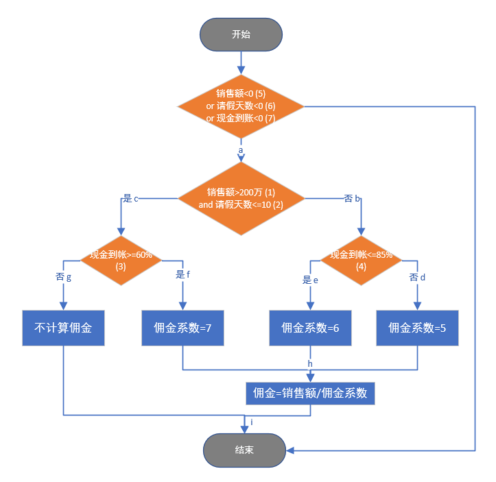

# 练习13：销售系统白盒测试

> 一销售系统，如果销售员的年销售额大于200万RMB且请假天数不超过10天的情况下，现金到帐大于等于60%，则佣金（提成）系数为7，即佣金值为销售额除以佣金系数；现金到帐小于60%，佣金不予计算。所有其他情况且现金到帐小于等于85%，则按佣金系数均为6计算佣金，现金到账大于85%，佣金系数按5处理。根据题意设计流程图并设计测试用例实现白盒测试（White Box Test）的1）语句覆盖，2）判断覆盖，3）simple条件覆盖，4）判断—条件覆盖，5）multiple条件组合覆盖（测试用例及覆盖表示要清晰）。

根据题目要求，编写代码，得出的CFG如下：

| 条件                      | 真 | 假 |
|---------------------------|----|----|
| AnnualSales > 200         | T1 | F1 |
| LeaveDays <= 10           | T2 | F2 |
| CashtoAccountRate <= 0.85 | T3 | F3 |
| CashtoAccountRate >= 0.60 | T4 | F4 |
| AnnualSales < 0           | T5 | F5 |
| LeaveDays < 0             | T6 | F6 |
| CashtoAccountRate < 0     | T7 | F7 |

## 语句覆盖

设计若干个用例，使得每个可执行语句至少被执行一次

| 用例编号 | AnnualSales | LeaveDays | CashRate | 覆盖语句       |
|----------|-------------|-----------|----------|------------|
| 1        | 100         | 10        | 0.5      | abe 佣金系数=6 |
| 2        | 100         | 10        | 0.9      | abd 佣金系数=5 |
| 3        | 300         | 10        | 0.7      | acf 佣金系数=7 |
| 4        | 300         | 10        | 0.5      | acg 不计算佣金 |

## 判断覆盖

每个判断的真假分支各执行一次，具体用例与1相同

| 测试用例编号 | AnnualSales | LeaveDays | CashRate | 覆盖分支 |
|--------------|-------------|-----------|----------|----------|
| 1            | 100         | 10        | 0.5      | b,e      |
| 2            | 100         | 10        | 0.9      | b,d      |
| 3            | 300         | 10        | 0.7      | c,f      |
| 4            | 300         | 10        | 0.5      | c,g      |

## 条件覆盖

每个判断中每个条件的可能取值都至少满足一次

| 测试用例编号 | AnnualSales | LeaveDays | CashRate | 覆盖条件 |
|--------------|-------------|-----------|----------|----------|
| 1            | 100         | 10        | 0.1      | F1,T2,F3 |
| 2            | 100         | 20        | 0.9      | F1,F2,T3 |
| 3            | 300         | 5         | 0.7      | T1,T2,T4 |
| 4            | 300         | 5         | 0.5      | T1,T2,F4 |

## 判断-条件覆盖

每个条件至少满足一次，每个判断本身的判定结果也出现至少一次

| 测试用例编号 | AnnualSales | LeaveDays | CashRate | 覆盖条件 | 覆盖分支 |
|--------------|-------------|-----------|----------|----------|----------|
| 1            | 100         | 10        | 0.1      | F1,T2,F3 | b,e      |
| 2            | 100         | 20        | 0.9      | F1,F2,T3 | b,d      |
| 3            | 300         | 5         | 0.7      | T1,T2,T4 | c,f      |
| 4            | 300         | 5         | 0.5      | T1,T2,F4 | c,g      |

## 条件组合覆盖

所有可能的条件取值组合都至少执行一次

| 组合编号 | 组合                           | 条件  |
|----------|--------------------------------|-------|
| 1        | AnnualSales>=200 LeaveDays<=10 | T1,T2 |
| 2        | AnnualSales>=200 LeaveDays>10  | T1,F2 |
| 3        | AnnualSales<200 LeaveDays<=10  | F1,T2 |
| 4        | AnnualSales<200 LeaveDays>10   | F1,F2 |
| 5        | commissionRate>0.85            | T3    |
| 6        | commissionRate<=0.85           | F3    |
| 7        | commissionRate>=0.6            | T4    |
| 8        | commissionRate<0.6             | F4    |

| 测试用例 | AnnulSales | LeaveDays | CashRate | 覆盖组合号 | 路径  | 覆盖条件 |
|----------|------------|-----------|----------|------------|-------|----------|
| 1        | 100        | 10        | 0.5      | 3 6        | a,b,e | F1,T2,F3 |
| 2        | 100        | 20        | 0.9      | 4 5        | a,b,d | F1,F2,T3 |
| 3        | 300        | 5         | 0.7      | 1 7        | a,c,f | T1,T2,T4 |
| 4        | 300        | 5         | 0.5      | 1 8        | a,c,g | T1,T2,F4 |
| 5        | 300        | 20        | 0.5      | 2 6        | a,b,e | T1,F2,F3 |

